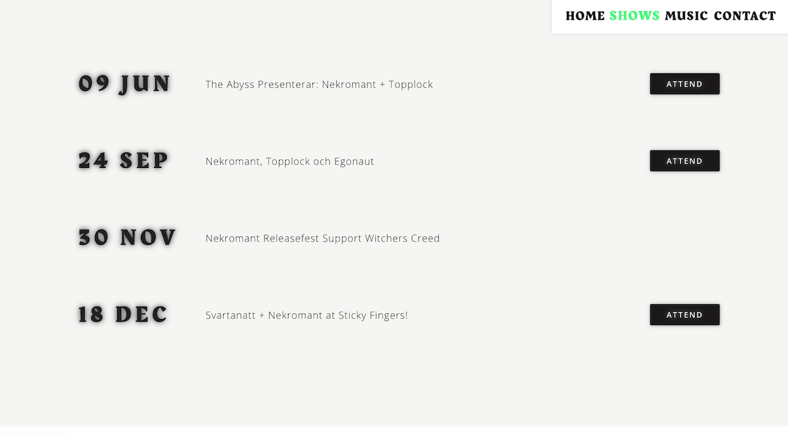

# Website for Nekromant



A website build in React for the band Nekromant. You can listen to their music, find contact information and information about their next shows. 
The band easily uploads upcoming shows thanks to Headless CMS (Contentful).

## Link 

https://nekromant.netlify.app/

## Installation
- Clone the repository
```
$ git clone https://github.com/majaalin/Nekromant
```
- In the project directory, run: 
- Start a local server
```
$ npm start
```
- This runs the app in the development mode. Open http://localhost:3000 to view it in the browser.

## License
This project is licensed under the MIT License.